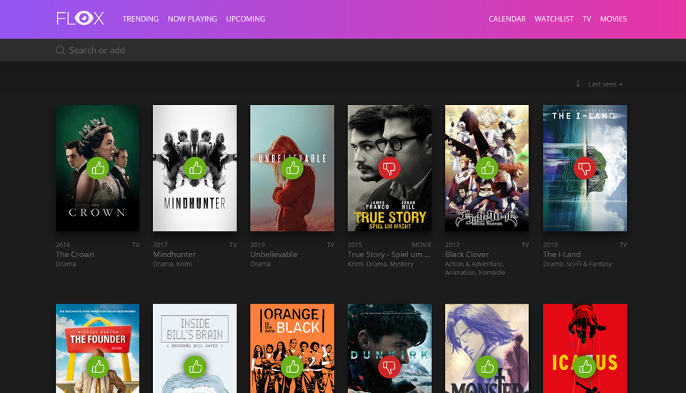

Flox
===============
[](https://travis-ci.org/devfake/flox)

Flox is a self hosted Movie, Series and Animes watch list. It's build on top of Laravel and Vue.js and uses [The Movie Database](https://www.themoviedb.org/) API.
The rating based on an 3-Point system for `good`, `medium` and `bad`.

### [Try live demo](https://flox-demo.pyxl.dev) and [login](https://flox-demo.pyxl.dev/login) with `demo / demo` to add new stuff or change ratings.



### Requirements

* PHP >=7.2
* Database (MySQL or [other](https://laravel.com/docs/6.x/database))
* [Composer](https://getcomposer.org/)
* The Movie Database Account for the free [API-Key](https://www.themoviedb.org/faq/api)

### Install

```bash
git clone https://github.com/devfake/flox
cd flox/backend
composer install
php artisan flox:init # Enter here your database credentials
```

Enter your TMDb API-Key in `backend/.env`. Then run:
```bash
php artisan flox:db # Running migrations and enter your admin credentials for the site
```

* Give `backend/storage`, `public/assets` and `public/exports` recursive write access.
* Set the correct `APP_URL` in `backend/.env`.
* Set your `CLIENT_URI` in `backend/.env`.
```bash
# CLIENT_URI=/flox/public
https://localhost:8888/flox/public

# CLIENT_URI=/subfolder/for/flox/public
https://mydomain.com/subfolder/for/flox/public

# CLIENT_URI=/
https://mydomain.com
```

### Features

- API for Plex.
  - Sync movies, shows and watched episodes from Plex to Flox.
- Episode Tracking.
- Suggestions.
- Watchlist.
- Popular Movies and Shows, Upcoming and Current Movies.
  - This lists are updated daily.
- Calendar.
  - A simple calendar for your episodes and movies.
  - Movies and tv shows have different colors for better differentiation. You can also use the arrow keys to jump months forward or backward.
- Reminders.

### Plex

To enable the sync from Plex to Flox, you first need to generate an API-Key in Flox in the settings page. Then enter the Flox API-URL to the webhooks section in Plex.

```
https://YOUR-FLOX-URL/api/plex?token=YOUR-TOKEN
```

If you start a tv show or movie in Plex, Flox will search the item via the title from TMDb and add them into the Flox database. If you rate a movie or tv show in Plex, Flox will also rate the item. Note that rating for seasons or episodes are not supported in Flox. If you rate an movie or tv show, which is not in the Flox database, Flox will also fetch them from TMDb first. If you complete an episode (passing the 90% mark), Flox will also check this episode as seen.

### Queue

To import or refresh any of your entries you need to have at least one worker running.

```bash
# spawn a single worker
php artisan queue:work --daemon --tries=3

# Alternatively install it as a systemctl service:

# The script uses the current directory as Flox root path. To override
# use the first argument and set a new absolute Flox (root) path.
# A second argument takes the php path (defaults to /usr/bin)
bash ./bin/install_worker_service.sh
# bash ./bin/install_worker_service.sh $HOME/flox /custom/path/to/php/
```

Check the [documentation](https://laravel.com/docs/5.5/queues) for more informations.

### Cron Job

To utilize the queues to update automatically you have to set up a cron task once manually on your server.

```
* * * * * php /path/to/artisan schedule:run >> /dev/null 2>&1
```

You can use ```crontab -e``` to add this new Cron task.

Make sure Cron is running and you are good to go.
```
sudo service cron status
```

This Cron will call the Laravel command scheduler every minute. Then, Laravel evaluates your scheduled tasks and runs the tasks that are due.

Currently in Flox defined tasks (which you can activate in the settings):

| When   | Description                     |
| ------ | ------------------------------- |
| Daily  | Update all Entities from TMDb   |
| Daily  | Send a daily reminder via mail   |
| Weekly  | Send a weekly summary via mail   |

You can change the time for daily and weekly reminder in your `.env`.

### Export / Import

Also you can make a backup of all your movies and shows in the settings page. If you click the `EXPORT` button, there will be an download for an `json` file. This file contains all your movies and shows from your database. This backup file will also be automatically saved in your `public/exports` folder.

If you import an backup, all movies and shows in your database will be deleted and replaced. Be sure to make an current backup before you import.
The import will download all poster images.

### Refresh data

To keep your entries up to date (e.g. ratings, episodes, images) you need to refresh them. In the settings there is the possibility to refresh the data manually or via a cron job (you need the queue worker for this). If you want to refresh only a single entry, there is a button on the subpage of this item.

### Reminders

Flox can send you a daily reminder of episodes or movies coming out today via mail. Or a weekly summary of episodes and movies coming out in the last 7 days. There are options in the settings page for this.

Make sure you tweak the `DATE_FORMAT_PATTERN` config in your `.env` file.

### Translation

All titles are in english by default. You can change your language by setting `TRANSLATION` in `backend/.env`. The most commons are `DE`, `IT`, `FR`, `ES` and `RU`. You can try to use your language code.

This will also affect the language of you website. See in `client/resources/languages` if your language is supported. Pull requests are welcome :)

If there isn't a translation for your language, english will be used.

### Settings

You can edit your admin account (username and password) in the settings page (link is in footer).

You can also set options to display release date and/or genre of your own list. Both will still display on search, trending and upcoming. If you want to hide your ratings (or show only on hover) there is also an option for this.

There is an option to enable or disable spoiler protection for episode names.

### Troubleshooting

#### Import does not work

- Your import file is probably to big. In default php.ini the max upload file is 2MB. Set the number higher and try again.
- Make sure that the queue worker is active! Otherwise flox will tell you the import is running, but nothing happens!

### Development

* Run `npm install` or `yarn` in your `/client` folder.
* Run `npm run dev`.

### Contribution

Like this project? Want to contribute? Awesome! Feel free to open some pull requests or just open an issue.

### Changelog

Detailed changes for each release are documented in the [release notes](https://github.com/devfake/flox/releases).

### License

Flox is published under the MIT license. See LICENSE for more information.
